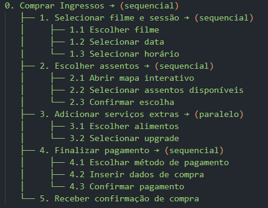
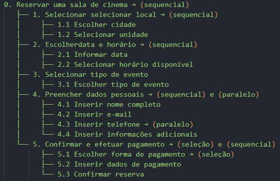

### **Introdução**

A análise de tarefas é um método essencial para compreender o trabalho dos usuários, como eles realizam suas ações e os motivos por trás delas. Nesse contexto, o trabalho é definido em termos dos objetivos que os usuários desejam ou precisam alcançar.

Esse tipo de análise pode ser usado para avaliar a situação atual, para o redesenho ou para a avaliação de intervenções, como a introdução de um novo sistema. Uma das etapas fundamentais nessa análise é coletar e identificar os objetivos que os usuários pretendem atingir com o sistema em questão.

No caso do Cinemark, o site possue como foco central a experiência do cliente em relação à compra de ingressos e ao acesso à programação dos cinemas. Outras funcionalidades incluem a compra de alimentos, consulta ao histórico de compras, gerenciamento de reservas, informações sobre promoções e fidelidade.

As tarefas principais selecionadas para análise foram:

- **Comprar ingressos para filmes em cartaz e alimentos**
- **Realizar reserva de salas**
- **Consultar os benefícios do CinemarkClub**
- **Vouchers Corporativos**

Essas tarefas foram definidas seguindo os dados do perfil dos usuários, que apontam maior uso dessas funções no site e aplicativo do Cinemark.

### **Metodologia**

Para analisar as tarefas realizadas pelos usuários do Cinemark, utilizamos duas técnicas, a Análise Hierárquica de Tarefas (HTA), que foi aplicada para tarefas complexas e sequenciais, e Árvore de Tarefas Concorrentes (CTT), utilizada em tarefas com escolhas ou interações simultâneas. Cada uma foi selecionada com base nas características das tarefas e no nível de interação necessário.

### **Análise Hierárquica de Tarefas**

**Análise HTA 1: Comprar ingressos**

A compra de ingressos é uma das principais tarefas realizadas pelos usuários do Cinemark. Esta tarefa envolve múltiplas etapas, como seleção do filme, escolha da sessão, dos assentos e finalização do pagamento. Análise detalhada:

|       Objetivos/Operações        |       Relações        |                                                                                 Plano                                                                                  |                                                                       Problemas e Recomendações                                                                        |
| :------------------------------: | :-------------------: | :--------------------------------------------------------------------------------------------------------------------------------------------------------------------: | :--------------------------------------------------------------------------------------------------------------------------------------------------------------------: |
|       0. Comprar ingressos       | 0 > 1 > 2 > 3 > 4 > 5 | Seguir a sequência de passos: acessar site/app > selecionar filme e sessão > escolher assentos > adicionar serviços extras > finalizar pagamento > receber confirmação |                                                                                   -                                                                                    |
|   1. Selecionar filme e sessão   |    1.1 > 1.2 > 1.3    |                                          Seguir a sequência: escolher filme > selecionar data > selecionar horário da sessão                                           |        Menu de filmes ou horários pode estar mal organizado ou conter excesso de informações. Utilizar filtros intuitivos (gênero, horário e disponibilidade).         |
|       2. Escolher assentos       |    2.1 > 2.2 > 2.3    |                                                 Plano: clicar no mapa interativo e selecionar os assentos disponíveis                                                  | Usuários podem ter dificuldades em usar o mapa se a interface for complexa ou pouco responsiva. Fornecer legendas claras (assentos disponíveis, ocupados, acessíveis). |
|   3. Adicionar serviços extras   |       3.1 + 3.2       |                                                       Escolher alimentos ou selecionar upgrade para sala premium                                                       |             Usuários podem não perceber a opção de serviços extras se não estiverem bem visíveis. Apresentar sugestões personalizadas durante o processo.              |
|      4. Finalizar pagamento      |    4.1 > 4.2 > 4.3    |                                              Escolher método de pagamento, inserir dados de pagamento e confirmar compra                                               |      Falha no processamento ou tempo de resposta lento pode causar desistência da compra. Oferecer opções de pagamento rápido e garantir segurança na interface.       |
| 5. Receber confirmação de compra |           -           |                                                               Exibir mensagem ou e-mail de confirmação.                                                                |                                                                                   -                                                                                    |

Autor: [Anne de Capdeville](https://github.com/nanecapde) e [José Felipe](https://github.com/Jose1277).

Segue o Diagrama HTA:

Autor: [Anne de Capdeville](https://github.com/nanecapde).

**Análise de Tarefas HTA 2: Reserva de Salas**

O Cinemark disponibiliza a funcionalidade de reserva de salas para eventos particulares, como reuniões corporativas, festas de aniversário ou exibições exclusivas de filmes. O processo é realizado de forma online por meio do site ou aplicativo.

|      Objetivos/Operações       |       Relações        |                                                                 Plano                                                                  |                                                                       Problemas e Recomendações                                                                       |
| :----------------------------: | :-------------------: | :------------------------------------------------------------------------------------------------------------------------------------: | :-------------------------------------------------------------------------------------------------------------------------------------------------------------------: |
| 0. Reservar uma sala de cinema | 0 > 1 > 2 > 3 > 4 > 5 |           Acessar site > selecionar local > selecionar data > selecionar tipo de evento > preencher dados > efetuar reserva            |                                                                                   -                                                                                   |
|      1. Selecionar local       |       1.1 > 1.2       |                                        Seguir a sequência: escolher cidade > selecionar unidade                                        |                          Usuários podem não encontrar rapidamente o local desejado. Incluir filtros por região e lista de unidades próximas.                          |
|   2. Escolher data e horário   |       2.1 > 2.2       |                                   Seguir a sequência: informar data > selecionar horário disponível                                    |                Horários indisponíveis podem causar frustração ao usuário. Apresentar apenas os horários livres e permitir consulta rápida das opções.                 |
|  3. Selecionar tipo de evento  |          3.1          |                                Escolher tipo de evento(corporativo, exibição privada) e personalização                                 |                                                                                   -                                                                                   |
|  4. Preencher dados pessoais   | 4.1 > 4.2 > 4.3 > 4.4 |        Seguir a sequência: Inserir nome completo > inserir e-mail > inserir telefone > inserir informações adicionais(opcional)        |                                                                                   -                                                                                   |
|       5. Efetuar reserva       |    5.1 > 5.2 > 5.3    | Seguir a sequência: escolher forma de pagamento(pagamento ou orçamento) > inserir dados do pagamento(se aplicável) > confirmar reserva | Usuários podem não se sentir seguros ao inserir dados financeiros. Garantir que a interface transmita segurança, incluindo selos de proteção de dados e criptografia. |

Autor: [Anne de Capdeville](https://github.com/nanecapde).

Segue o Diagrama HTA:

Autor: [Anne de Capdeville](https://github.com/nanecapde).

**Análise de Tarefas HTA 3: Cinemark Club**

O Cinemark Club é o programa de assinatura que oferece descontos em ingressos e outros benefícios exclusivos para os membros. A tarefa analisada aborda o processo de adesão ao clube.

|       Objetivos/Operações        |   Relações    |                     Problemas e Recomendações                     |
| :------------------------------: | :-----------: | :---------------------------------------------------------------: |
| 0. Inscrever-se no Cinemark Club | 1 > 2 > 3 > 4 |      Problema: Informações pouco claras sobre os benefícios       |
|  1. Acessar página de inscrição  |               | Plano: Entrar no site/app e navegar até a página do Cinemark Club |
|       2. Selecionar plano        |               |   Plano: Escolher entre os planos disponíveis (mensal ou anual)   |
|   3. Preencher dados pessoais    |               |      Plano: Informar nome, CPF, e-mail e dados de pagamento       |
|       4. Confirmar adesão        |               |         Plano: Aceitar os termos e confirmar o pagamento          |

Autor: [Anne de Capdeville](https://github.com/nanecapde).

**Análise de Tarefas HTA 4: Voucher Corporativo**

O Voucher Corporativo é uma funcionalidade voltada para empresas que desejam adquirir ingressos em grande quantidade para colaboradores ou parceiros.

|            Objetivos/Operações             | Relações  |                          Problemas e Recomendações                           |
| :----------------------------------------: | :-------: | :--------------------------------------------------------------------------: |
|     0. Adquirir vouchers corporativos      | 1 > 2 > 3 |     Problema: Falta de transparência no processo de entrega dos vouchers     |
| 1. Selecionar quantidade e tipo de voucher |           |        Plano: Escolher entre vouchers de ingressos normais ou premium        |
|        2. Informar dados da empresa        |           | Plano: Preencher informações da empresa, como CNPJ e endereço de faturamento |
|           3. Confirmar pagamento           |           |          Plano: Escolher forma de pagamento e concluir a transação           |

Autor: [Anne de Capdeville](https://github.com/nanecapde).

### **Árvore de Tarefas Concorrentes (CTT) - Cinemark**

**Motivo da Escolha**

A Árvore de Tarefas Concorrentes (CTT) foi escolhida para analisar as interações de usuários no sistema Cinemark, pois ela permite representar de forma clara as tarefas concorrentes e sequenciais que ocorrem durante o processo de compra de ingressos, reserva de salas e gestão de benefícios como o Cinemark Club e o voucher corporativo. Esta técnica ajuda a identificar tarefas que podem ser realizadas ao mesmo tempo e a entender as dependências entre elas.

Autor: [Anne de Capdeville](https://github.com/nanecapde).

**Análise da Tarefa CTT 1: Compra de ingressos e alimentos**

A tarefa "Compra de ingressos e alimentos" envolve várias interações do usuário com o sistema, onde o usuário escolhe o filme, sessão, o horário, assentos e serviços extras(compra de alimentos). Além disso, pode incluir uma etapa de pagamento.

|       Objetivos/Operações        |       Relações       |                                         Plano                                         |                                                                       Problemas e Recomendações                                                                        |
| :------------------------------: | :------------------: | :-----------------------------------------------------------------------------------: | :--------------------------------------------------------------------------------------------------------------------------------------------------------------------: |
|   1. Selecionar filme e sessão   |          >>          | Seguir a sequência: escolher filme >> selecionar data >> selecionar horário da sessão |        Menu de filmes ou horários pode estar mal organizado ou conter excesso de informações. Utilizar filtros intuitivos (gênero, horário e disponibilidade).         |
|       2. Escolher assentos       |          >>          |        Plano: clicar no mapa interativo >> selecionar os assentos disponíveis         | Usuários podem ter dificuldades em usar o mapa se a interface for complexa ou pouco responsiva. Fornecer legendas claras (assentos disponíveis, ocupados, acessíveis). |
|   3. Adicionar serviços extras   | Paralelismo Opcional |              Escolher alimentos ou selecionar upgrade para sala premium               |             Usuários podem não perceber a opção de serviços extras se não estiverem bem visíveis. Apresentar sugestões personalizadas durante o processo.              |
|      4. Finalizar pagamento      |          >>          |    Escolher método de pagamento >> inserir dados de pagamento >> confirmar compra     |      Falha no processamento ou tempo de resposta lento pode causar desistência da compra. Oferecer opções de pagamento rápido e garantir segurança na interface.       |
| 5. Receber confirmação de compra |          >>          |                       Exibir mensagem ou e-mail de confirmação.                       |                                                                                   -                                                                                    |

Autor: [Anne de Capdeville](https://github.com/nanecapde) e [José Felipe](https://github.com/Jose1277).

Segue o Diagrama CTT:

Autor: [Anne de Capdeville](https://github.com/nanecapde).

**Análise da Tarefa CTT 2: Reserva de Salas**

A tarefa "Reserva de Salas" envolve várias interações do usuário com o sistema, onde o usuário escolhe o filme, o horário, a sala, o tipo de evento e a quantidade de ingressos. Além disso, pode incluir uma etapa de pagamento.

|      Objetivos/Operações       |       Operador       |                                                                Plano                                                                 |                                                       Problemas e Recomendações                                                        |
| :----------------------------: | :------------------: | :----------------------------------------------------------------------------------------------------------------------------------: | :------------------------------------------------------------------------------------------------------------------------------------: |
|      1. Selecionar local       |          >>          |                                      Seguir a sequência: escolher cidade >> selecionar unidade                                       |                          Dificuldade em localizar a unidade desejada. Apresentar filtros de busca por região.                          |
|   2. Escolher data e horário   |          >>          |                                  Seguir a sequência: informar data >> selecionar horário disponível                                  | Horários indisponíveis podem causar frustração ao usuário. Apresentar apenas os horários livres e permitir consulta rápida das opções. |
|  3. Selecionar tipo de evento  |          []          |                                                       Escolher tipo de evento                                                        |                                        Permitir personalizações dependendo do evento escolhido.                                        |
|  4. Preencher dados pessoais   |          >>          |     Seguir a sequência: Inserir nome completo >> inserir e-mail >> inserir telefone >> inserir informações adicionais(opcional)      |                 Falta de preenchimento correto dos campos. Implementar validação de campos e mensagens de erro claras.                 |
| 5. Confirmar e efetuar reserva | Paralelismo opcional | Seguir a sequência: escolher forma de pagamento(pagamento ou orçamento), inserir dados do pagamento(se aplicável), confirmar reserva |    Falta de confiança ao inserir informações financeiras. Garantir segurança por meio de selos de proteção de dados e criptografia.    |

Autor: [Anne de Capdeville](https://github.com/nanecapde).

Segue o Diagrama CTT:

Autor: [Anne de Capdeville](https://github.com/nanecapde).

**Análise da Tarefa CTT 3: Cinemark Club**

O Cinemark Club permite que os usuários acumulem pontos para trocar por ingressos ou benefícios exclusivos. O processo para gerenciar o Cinemark Club inclui fazer login, verificar os pontos acumulados, resgatar prêmios, e eventualmente, renovar a associação.

Fluxo da Tarefa:

- **O usuário acessa sua conta no Cinemark Club.**
- **O usuário consulta a quantidade de pontos acumulados.**
- **O usuário escolhe um prêmio ou benefício para resgatar.**
- **O usuário aplica o resgate de pontos na compra de ingressos ou produtos.**
- **O sistema atualiza os pontos após o resgate.**
- **O usuário recebe um comprovante de resgate.**

**Análise da Tarefa CTT 4: Voucher Corporativo**

Os vouchers corporativos oferecem aos funcionários benefícios como ingressos ou descontos para sessões de cinema. O processo de resgatar um voucher corporativo pode ser feito através do site, sendo necessário um código de acesso fornecido pela empresa.

Fluxo da Tarefa:

- **O usuário acessa a página de resgate de vouchers corporativos.**
- **O usuário insere o código do voucher.**
- **O sistema valida o código.**
- **O sistema exibe os ingressos disponíveis para resgatar.**
- **O usuário escolhe os ingressos desejados e confirma o resgate.**
- **O sistema processa o resgate e envia a confirmação por e-mail ou mensagem.**

## Bibliografia

Barbosa S. D. J., Silva B. S. da. Interação Humano-Computador. Elsevier, 2010.

## Histórico de versões

| Versão |     Descrição      |                     Autor(es)                      |    Data    |                    Revisor(es)                     | Data de revisão |
| :----: | :----------------: | :------------------------------------------------: | :--------: | :------------------------------------------------: | :-------------: |
|  1.0   | Criação da página  |   [Ana Joyce](https://github.com/anajoyceamorim)   | 01/12/2024 | [Anne de Capdeville](https://github.com/nanecapde) |   01/12/2024    |
|  2.0   | Conteúdo da página | [Anne de Capdeville](https://github.com/nanecapde) | 02/12/2024 |   [Ana Joyce](https://github.com/anajoyceamorim)   |   03/12/2024    |
|  3.0   | Correção da página | [Anne de Capdeville](https://github.com/nanecapde) | 04/02/2025 |  [Ana Joyce](https://github.com/anajoyceamorim)    |   05/02/2025    |
