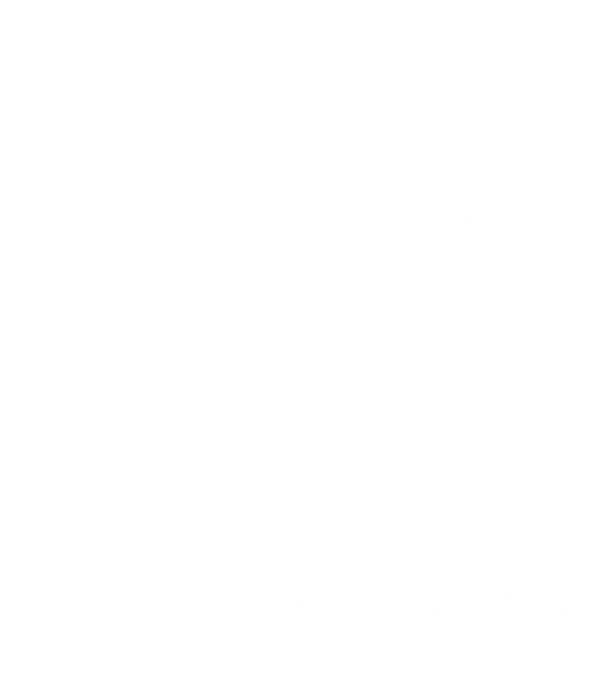

# Processos de Design em IHC

## **Introdução**

Antes de explorarmos a Engenharia de Usabilidade de Mayhew, é essencial compreender o que é um processo de design. Segundo Barbosa e Silva (2011), design pode ser definido como um processo composto por três atividades fundamentais: análise da situação atual (identificação de um problema), síntese de uma intervenção e avaliação da nova situação resultante dessa intervenção.

Dessa forma, processos de design são abordagens sistemáticas e iterativas que possibilitam a realização dessas atividades, garantindo que as soluções desenvolvidas atendam às necessidades dos usuários. Um desses processos é o modelo proposto por Deborah Mayhew, que será detalhado neste documento.

---

## **Metodologia**

Os processos de design de IHC utilizam uma variedade de abordagens e métodos, cada um adequado a diferentes contextos e objetivos. Esses métodos incluem ciclos de vida iterativos, design contextual, e estratégias baseadas em cenários e objetivos.

---

## **Modelos**

1. **Ciclo de Vida Simples**  
   Um modelo linear com foco em etapas sequenciais, incluindo requisitos, design, implementação e avaliação. É ideal para projetos simples, mas carece de flexibilidade.

2. **Ciclo de Vida em Estrela**  
   Propõe uma abordagem não-linear, permitindo que qualquer etapa do processo possa ser revisitada a qualquer momento. Enfatiza a avaliação contínua.

3. **Engenharia de Usabilidade de Nielsen**  
   Envolve atividades como análise competitiva, design participativo, aplicação de heurísticas, prototipagem e testes empíricos, promovendo iterações constantes para refinar a usabilidade.

4. **Engenharia de Usabilidade de Mayhew**  
   Baseia-se em um processo mais estruturado e detalhado, focado em análise de tarefas, definição de métricas de usabilidade e avaliação contínua.

5. **Design Contextual**
   Focado em entender o contexto real de uso, incluindo:  
   - **Investigação contextual**: Identificar usuários, objetivos e ambientes.  
   - **Modelagem do trabalho**: Mapear fluxos, artefatos e aspectos culturais.  
   - **Consolidação e reprojeto**: Refinar o design para atender melhor às necessidades identificadas.  
   - **Prototipação e testes**: Validar soluções diretamente com os usuários.

6. **Design Baseado em Cenários**
   Utiliza histórias fictícias para explorar como os usuários interagem com o sistema, considerando diferentes contextos e objetivos. Ajuda na identificação de requisitos e avaliação de alternativas de design.

7. **Design Dirigido por Objetivos**
   Concentra-se em atender objetivos específicos dos usuários, priorizando suas metas em todas as etapas do processo de design.

8. **Design Centrado na Comunicação**
   Foca na troca clara de informações entre os usuários e o sistema, garantindo que as interfaces sejam intuitivas e promovam um entendimento eficaz.

---

Este resumo sintetiza os principais conceitos do capítulo 4 de Barbosa e Silva, incluindo os diferentes processos de design em IHC e suas aplicações práticas. Cada abordagem oferece ferramentas e perspectivas distintas para lidar com os desafios de design centrado no usuário.

---

### **Escolha de processo de design para o Cinemark**

A melhor escolha de processo de design para a análise do site considerando que a Cinemark já possui um site em funcionamento e que o foco está na melhoria da experiência do usuário é a **Engenharia de Usabilidade de Mayhew**.

#### Engenharia de Usabilidade de Mayhew

1. Análise de Requisitos
   - Na fase inicial, são estabelecidas as metas de usabilidade com base em fatores como o perfil dos usuários, análise das tarefas, limitações e possibilidades da plataforma na qual o sistema será executado, e princípios gerais de design de Interação Humano-Computador (IHC). Para facilitar a verificação dessas metas ao longo do processo, é comum apresentá-las em um guia de estilo que inclui diretrizes relacionadas a elementos visuais da interface, como layout, cores, tipografia, imagens e ícones​

2. Design, Avaliação e Desenvolvimento
   - Esta fase visa criar uma interface que atenda às metas de usabilidade estabelecidas anteriormente. O processo ocorre em três níveis de detalhamento:
   - Primeiro nível: Revisão das tarefas e criação de protótipos de baixa fidelidade para avaliação inicial.
   - Segundo nível: Estabelecimento de padrões de design e construção de protótipos de média fidelidade.
   - Terceiro nível: Desenvolvimento detalhado da interface em alta fidelidade, pronto para implementação​
   - Durante todo o ciclo, os protótipos são avaliados e refinados iterativamente, com base no feedback dos usuários.

3. Instalação
   - Após a implementação do sistema, a fase de instalação inclui a coleta de feedback dos usuários sobre a experiência de uso. Esses dados são fundamentais para identificar melhorias para versões futuras ou até mesmo indicar a necessidade de um novo sistema

#### Razões para escolher a Engenharia de Usabilidade de Mayhew

1. **Abordagem estruturada e detalhada**
   - O modelo de Mayhew divide o processo em três fases bem definidas (Análise de Requisitos, Design/Avaliação/Desenvolvimento e Instalação), o que facilita a identificação e a solução de problemas no site da Cinemark.

2. **Foco na usabilidade e experiência do usuário**
   - Como o site da Cinemark tem funções críticas, como compra de ingressos, escolha de assentos e consulta de horários, garantir uma interface intuitiva e eficiente é essencial. O modelo de Mayhew permite avaliar essas necessidades desde a análise de requisitos até a implementação de melhorias.

3. **Ciclo iterativo de refinamento**
   - O processo envolve testes constantes e ajustes progressivos, garantindo que cada mudança no site seja baseada em dados e feedback reais dos usuários. Isso é crucial para evitar falhas que possam prejudicar a navegação e a experiência do cliente.

4. **Aplicação prática no cenário da Cinemark**
   - Como a Cinemark já possui um sistema em funcionamento, o modelo pode ser iniciado na fase de instalação, analisando feedback dos usuários para encontrar pontos de melhoria. Depois, pode-se retroceder à análise de requisitos para estruturar mudanças mais significativas.

Se o foco fosse um redesenho completo do site, outros modelos, como o Ciclo de Vida em Estrela (com forte ênfase na avaliação a cada etapa) ou a Engenharia de Usabilidade de Nielsen (com diretrizes heurísticas bem estabelecidas), também poderiam ser considerados. Porém, para aprimoramento e otimização contínua da usabilidade, a Engenharia de Usabilidade de Mayhew se destaca como a melhor escolha.

---

## Referências

> BARBOSA, S. D. J.; SILVA, B. S. Interação Humano-Computador. Rio de Janeiro: Elsevier, 2021.

---

## Histórico de versões

| Versão |     Descrição      |                     Autor(es)                     |    Data    |                     Revisor(es)                     | Data de revisão |
| :----: | :----------------: | :-----------------------------------------------: | :--------: | :-------------------------------------------------: | :-------------: |
|  1.0   | Criação da página e conteúdo | [Ana Joyce](https://github.com/anajoyceamorim) | 19/11/2024 | [Pedro Miguel](https://github.com/pedroMADBR) |   19/11/2024   |
|  2.0   | Correções do modelo | [Pedro Miguel](https://github.com/pedroMADBR) | 04/02/2025 | [nome](https://github.com/nome) |   xx/xx/2025   |
